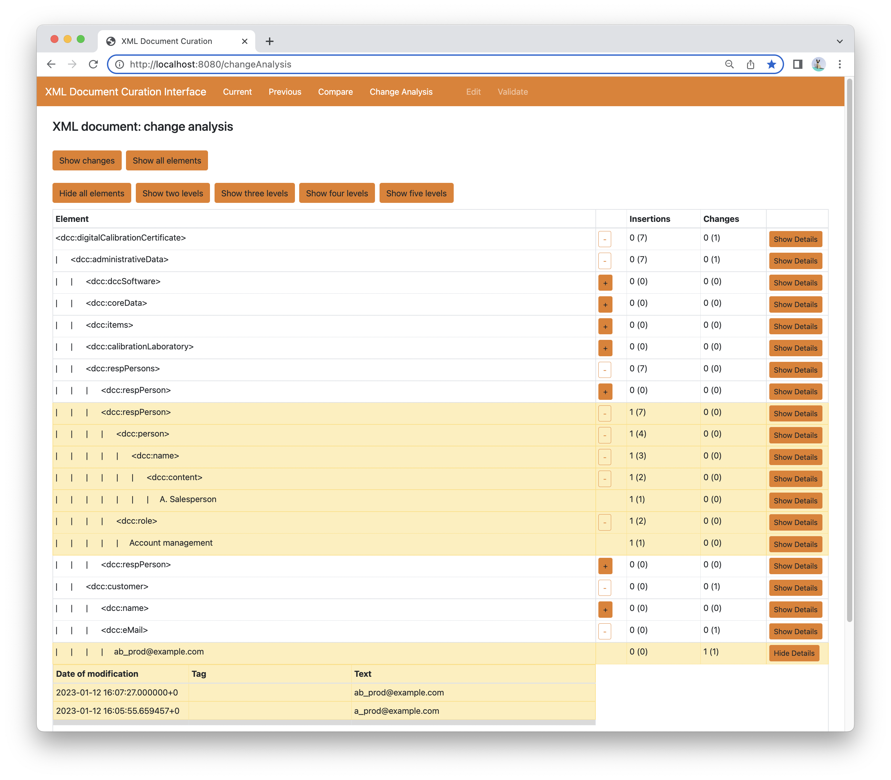

# Update provenance of digital calibration certificates using Links and temporal databases

This [Links](https://links-lang.org) prototype provides an interface to display a [Digital Calibration Certificate](https://www.ptb.de/dcc/) (DCC) in XML, to compare two versions of the document, and to see all changes that have occurred in the document. The prototype works for DCCs structured according to the [DCC](https://www.ptb.de/dcc/v3.1.0/autogenerated-docs/doku_3.1.0_all.html) and [D-SI](https://gitlab1.ptb.de/d-ptb/d-si/xsd-d-si) XML schemas. It can also be applied more generally to any XML document.

(Note that this is a prototype, hence some functionality has not
been implemented and not all menu items in the interface will respond, in particular the edit functionality has not been fully implemented yet.
Furthermore, there is no checking for the input of date formats and a string that cannot be parsed as a date by Links will cause an error.)

### Temporal database usage

This prototype uses Links temporal database features which work with a standard PostgreSQL database as the backend. It also uses the [Dynamic Dewey](https://doi.org/10.1145/1559845.1559921)
 (DDE) labelling scheme to uniquely label each node in an XML document and thereby provide a key for storing the node in a relational table. Using these together, it is possible to use store an XML document in a relational temporal databases -- see more details in [this paper](https://www.imeko.org/publications/tc6-2022/IMEKO-TC6-2022-024.pdf).
 
A PostgreSQL database is provided containing a sample DCC with modifications to illustrate the use of the prototype. Installation instructions are [here](INSTALL.md).

### User interface

The interface is built using the [Links MVU library](https://github.com/links-lang/links/wiki/Model-View-Update-(Elm-Architecture)) which utilises
*[Bootstrap](https://getbootstrap.com)* and which is based on the Model-Update-View
paradigm. This separates the code for rendering
webpages into two functions: a view function which describes how
to render the current model information as HTML, and which returns
a message when there is interaction with the page. The update
function receives these messages, and makes modifications to the
model depending on the message. After this, the page is refreshed.
Typically, the database interactions occur when the initial model
is defined, and when the update function calls the functions it
needs for modifying the model, leading to a separation of concerns.

